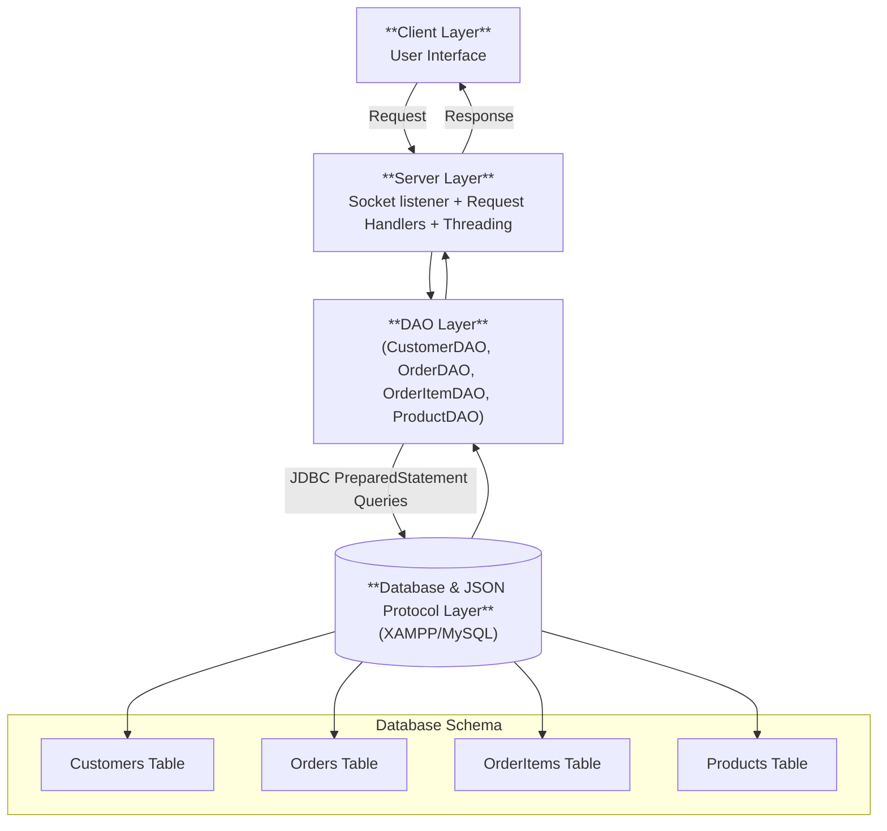

## Architecture Diagram

```mermaid
flowchart TD

Client["**Client Layer**<br>User Interface"]
Server["**Server Layer**<br>Socket listener + Request Handlers + Threading"]
DAO["**DAO Layer**<br>(CustomerDAO, OrderDAO, OrderItemDAO, ProductDAO)"]
Database[("**Database & JSON Protocol Layer**<br>(XAMPP/MySQL)")]

subgraph "Database Schema"
    Customers["Customers Table"]
    Orders["Orders Table"]
    OrderItems["OrderItems Table"]
    Products["Products Table"]
end

Client -- Request --> Server
Server -- Response --> Client

Server --> DAO
DAO --> Server

DAO -- JDBC PreparedStatement Queries --> Database
Database --> DAO

Database --> Customers
Database --> Orders
Database --> OrderItems
Database --> Products

```
